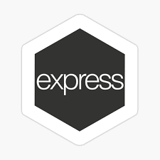
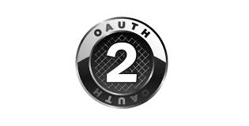
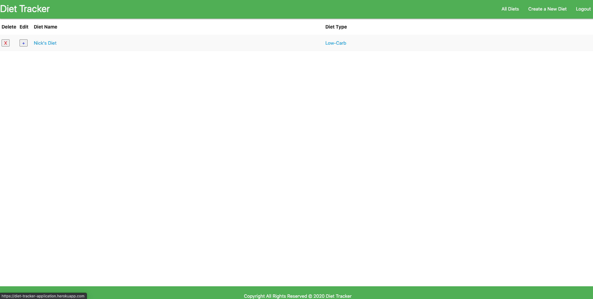
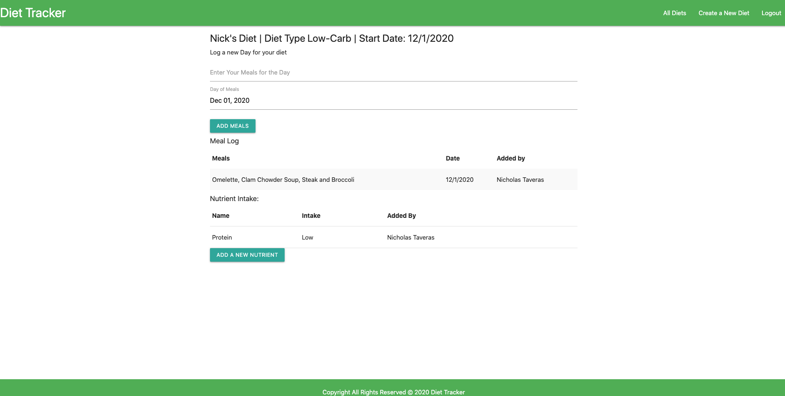

# Diet Tracker
--

The application allows you to create a diet with a type which will be the plan that you follow. You will be able to also add a start date and update daily to keep track of your meals and nutrient intake.

## Check it out @ [Diet Tracker](https://diet-tracker-application.herokuapp.com) 🌐

Features:
- 

---

Future Enhancements:
- Add a Way for people to set up a meal plan for however far into the future they want.
- Add functionality for the user to be able to calculate total daily/weekly nutrient intake.
- Blog page where people can talk about health and what diets have worked for them and their goals.
- Clean up the entire UI to be more visually appealing.
- Have the all Diets page appear as images with names instead of a list.
- Add Styling to be friendly to mobile devices.
- Add UI for Workouts
- Add API's for Diets and Workouts

## Technologies 💻
-  HTML5
-  CSS3
-  JavaScript
-  JQuery v3.5
-  Node.js
-  Express
-  MongoDB
-  🔐 OAuth

## Screenshots 📸

### Home Page

---

### Diets Page

---

### Specific Diet Page

---

## View Trello Planning @ [Diet Tracker Trello](https://trello.com/b/55tfsSSo/diet-tracker)

