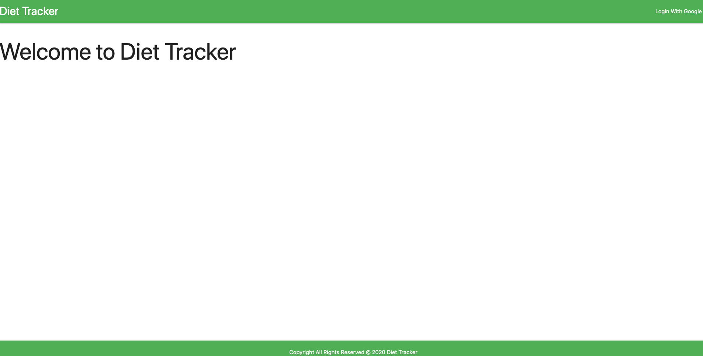
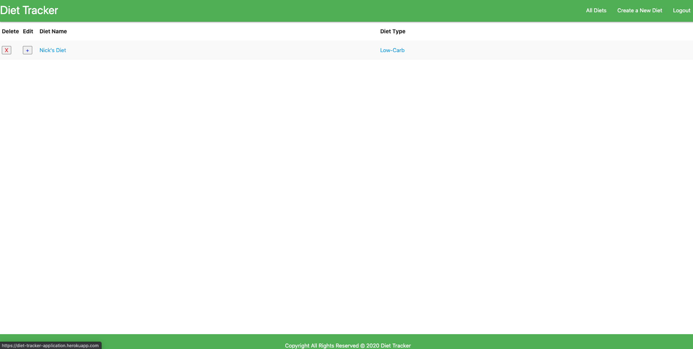
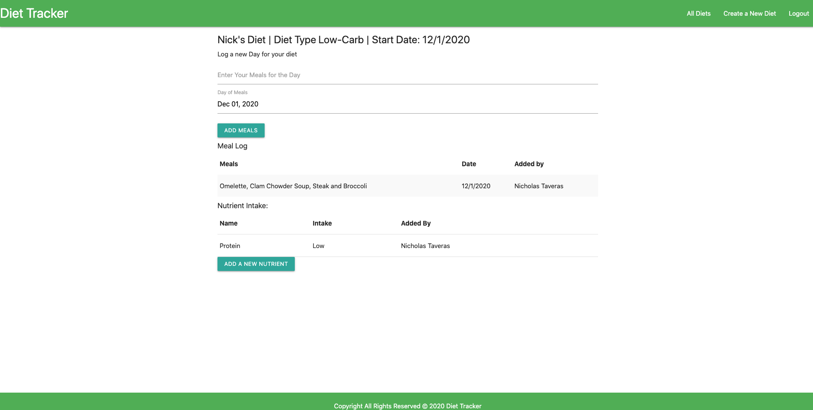

# Diet Tracker

## Version 1.0

- The application allows you to create a diet with a type which will be the plan that you follow. You will be able to also add a start date and update daily to keep track of your meals and nutrient intake.

## Screenshots

### HomePage

### Diets Page

### Specific Diet Page

## Technologies
- HTML5
- CSS3
- JavaScript
- Jquery v3.5
- Node.js
- Express
- MongoDB
- OAuth

## Getting Started

### Open Application

- https://diet-tracker-application.herokuapp.com

### View Trello Planning

- https://trello.com/b/55tfsSSo/diet-tracker

## Next Steps

- Add a Way for people to set up a meal plan for however far into the future they want.
- Add functionality for the user to be able to calculate total daily/weekly nutrient intake.
- Blog page where people can talk about health and what diets have worked for them and their goals.
- Clean up the entire UI to be more visually appealing.
- Have the all Diets page appear as images with names instead of a list.
- Add Styling to be friendly to mobile devices.

